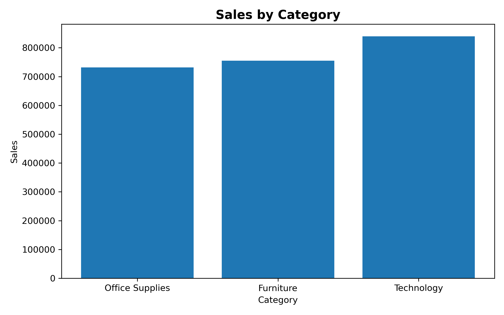
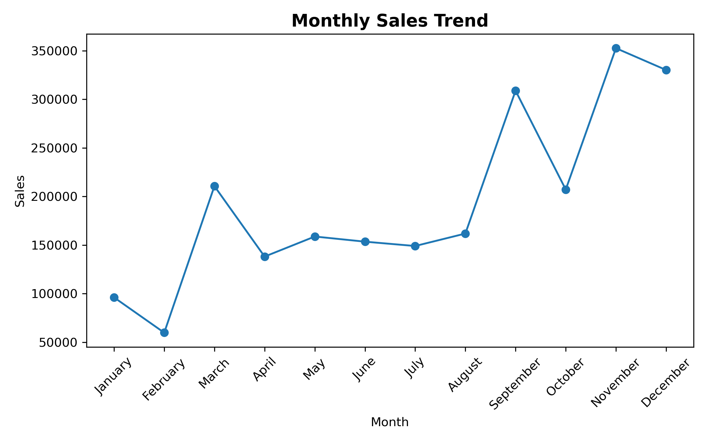
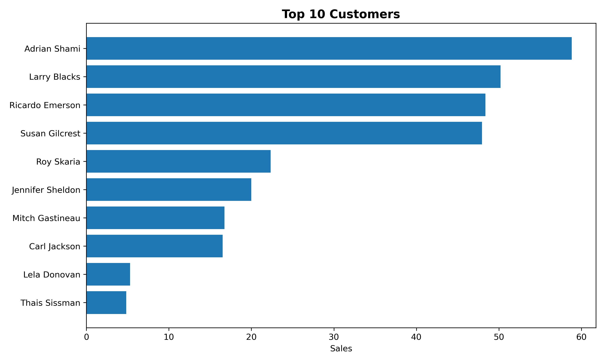
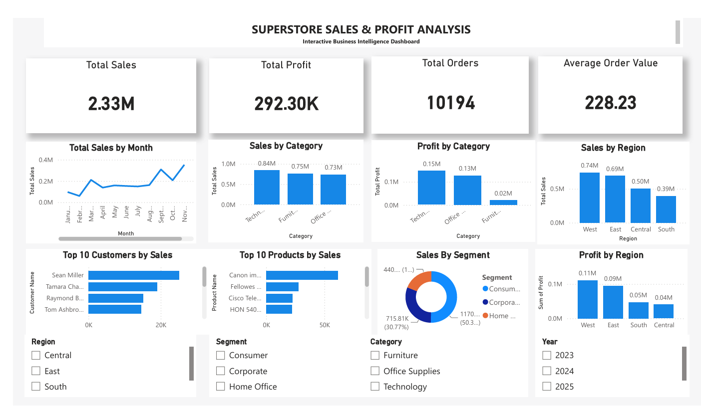

# 🐍 Python Sales Data Analysis (EDA)

## 📌 Project Overview

This project performs **Exploratory Data Analysis (EDA)** on the Sample Superstore dataset using **Python, Pandas, NumPy, and Matplotlib**.

The objective is to analyze sales performance, profitability, customer behavior, product performance, and regional trends to generate meaningful business insights through data analysis and visualization.

The project also includes an **interactive Power BI dashboard** for business intelligence and visual analysis.

---

## 📸 Project Preview

### Sales by Category



### Monthly Sales Trend



### Top 10 Customers



---

## 🎯 Objectives

- Import and explore the dataset
- Clean and preprocess the data
- Perform Exploratory Data Analysis (EDA)
- Analyze sales and profitability
- Analyze customer and product performance
- Answer real-world business questions
- Create informative visualizations
- Build an interactive Power BI dashboard
- Generate actionable business insights

---

## 🛠️ Technologies Used

- Python
- Pandas
- NumPy
- Matplotlib
- Jupyter Notebook
- Power BI
- Git & GitHub

---

## 📂 Dataset Information

- **Dataset:** Sample Superstore
- **Total Records:** 10,194
- **Total Columns:** 21
- **File Format:** CSV

---

## 📊 Key Performance Indicators (KPIs)

| KPI | Value |
|---|---:|
| Total Sales | $2,326,534.35 |
| Total Profit | $292,296.81 |
| Total Orders | 10,194 |
| Average Order Value | $228.23 |

---

## 📈 Business Questions Solved

- What are the total sales?
- What is the total profit?
- How many orders were placed?
- What is the average order value?
- Which category generates the highest sales?
- Which category generates the highest profit?
- Which region generates the highest sales?
- Which region generates the highest profit?
- Which customer segment contributes the highest sales?
- Who are the top 10 customers by sales?
- What are the top 10 products by sales?
- How do sales change month by month?
- What is the sales distribution?
- Which categories and regions perform best?

---

## 📊 Visualizations Created

- 📊 Sales by Category
- 📊 Profit by Category
- 📊 Sales by Region
- 📊 Profit by Region
- 📈 Monthly Sales Trend
- 📊 Top 10 Customers
- 📊 Top 10 Products
- 🥧 Sales by Segment
- 📉 Sales Distribution

---

## 💡 Key Business Insights

- **Technology** generated the highest sales at approximately **$839,893.28**.
- **Technology** generated the highest profit at approximately **$146,543.38**.
- **Furniture** recorded the lowest overall profit among the three categories.
- **West** generated the highest sales at approximately **$739,813.61**.
- **West** also generated the highest profit at approximately **$110,798.82**.
- **Consumer** was the highest-performing customer segment by sales.
- **Sean Miller** was the highest revenue-generating customer at approximately **$25,043.05**.
- Monthly sales showed noticeable fluctuations throughout the year.

---

# 📊 Power BI Dashboard

An interactive **Power BI dashboard** was created using the same Superstore dataset.
### 📸 Dashboard Preview



### Dashboard Features

- Total Sales KPI
- Total Profit KPI
- Total Orders KPI
- Average Order Value
- Monthly Sales Trend
- Sales by Category
- Profit by Category
- Sales by Region
- Profit by Region
- Top 10 Customers
- Top 10 Products
- Sales by Segment
- Region filter
- Category filter
- Segment filter
- Year filter

### Dashboard Preview

The Power BI dashboard provides interactive filtering and allows users to explore sales and profitability from different business perspectives.

### Power BI File

The Power BI `.pbix` file is available in:

```text
PowerBI/Superstore_Sales_Analysis.pbix

